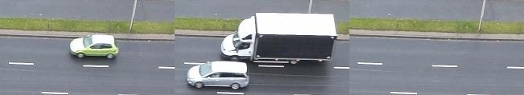

# IMAGE PROCESSING REPORT
- Eryk Ptaszyński 151950
- Eryk Walter 151931

This report describes the steps performed in the image_processor.py script for detecting and removing cars from a series of images.


### Step 1: Load Images

.|.|.
:--:|:--:|:--:
||
||

```python
def load_images(image_paths):
    return [cv2.cvtColor(cv2.imread(path), cv2.COLOR_BGR2RGB) for path in image_paths]
```
The load_images function reads each image from the provided paths, converts them from BGR to RGB color space (since OpenCV reads images in BGR format by default), and returns a list of images. Below is the base_frame image `(np.median([image1, image2, image3]))` we will use to paint over.


Difficult areas in our image:


### Step 2: Detect Cars

.|.|.
:--:|:--:|:--:
||

```python
def detect_cars(images):
    imamges_grey = [cv2.cvtColor(image, cv2.COLOR_RGB2GRAY)
                    for image in images]

    differences = [np.where(cv2.absdiff(image1, image2) > 64, 1, 0) for i, image1 in enumerate(
        imamges_grey) for j, image2 in enumerate(imamges_grey) if i != j and i < j]

    return [binary_opening(binary_erosion(binary_erosion(difference)))
            for difference in differences]
```
The detect_cars function first converts each image to grayscale. It then calculates the absolute difference between each pair of images, and applies a threshold to create a binary image where the differences are marked as 1 and the rest as 0. This binary image is then eroded twice and opened once to remove noise and separate the cars from each other.

### Step 3: Enhance Differences

.|.|.
:--:|:--:|:--:
||

```python
def enhance_differences(differences):
    return [np.where(cv2.dilate(difference.astype(np.uint8), np.ones(
        (37, 37), np.uint8), iterations=1) > 0, 1, 0) for difference in differences]
```
The enhance_differences function dilates each difference image to enhance the differences and make the cars more visible. It then applies a threshold to create a binary image where the differences are marked as 1 and the rest as 0.

### Step 4: Get Connected Components


```python
def get_connected_components(masks):
    return [cv2.connectedComponentsWithStats(mask.astype(np.uint8), 4) for mask in masks]
```
The get_connected_components function finds all connected components (groups of connected pixels) in each mask. It returns a list of tuples, where each tuple contains the number of labels, the label matrix, the statistics of the connected components, and the centroids of the connected components.

### tep 4.5: Extract Cars and Replace in Base Frame:
|.|
|:--:|
||
||
||


```python
cars = [image[top:top+height, left:left+width] for image in images]
base_frame[top:top+height, left:left+width] = cars[np.argmin([np.sum(image - np.full_like(image, fill_value=(120, 130, 130))) for image in cars], axis=0)]
```
In this step, for each connected component (which represents a car), we extract the corresponding region from each image. This is done using the top, left, width, and height values from the statistics of the connected component. The result is a list of images of the car from different frames.

Then, we find the image in this list that is most similar to a given color (120, 130, 130). This is done by calculating the sum of differences between each image and a same-sized image filled with the given color, and finding the image with the minimum sum of differences.

Finally, we replace the region in the base frame with the found image. This effectively removes the car from the base frame by replacing it with the most similar background.

### Overview:
```python
def remove_cars(images):
    base_frame = get_base_frame(images)
    differences = detect_cars(images)
    masks = enhance_differences(differences)
    connected_components = get_connected_components(masks)
    for i, connected_component in enumerate(connected_components):
        num_labels, labels, stats, centroids = connected_component
        for j, (stat, centroid) in enumerate(zip(stats[1:], centroids[1:])):
            left, top, width, height, area = stat
            cars = [image[top:top+height, left:left+width] for image in images]
            save_images(np.concatenate(cars, axis=1), f"cars/car_{i}_{j}")
            base_frame[top:top+height, left:left+width] = cars[np.argmin(
                [np.sum(image - np.full_like(image, fill_value=(120, 130, 130))) for image in cars], axis=0)]
```
The remove_cars function first gets the base frame by taking the median of the images. It then detects the cars, enhances the differences, and gets the connected components. For each connected component, it calculates the bounding box and extracts the corresponding region from each image. It then replaces the region in the base frame with the region from the image that has the minimum sum of differences from (120, 130, 130). Finally, it saves the base frame as no_cars.JPG.

## Results:


